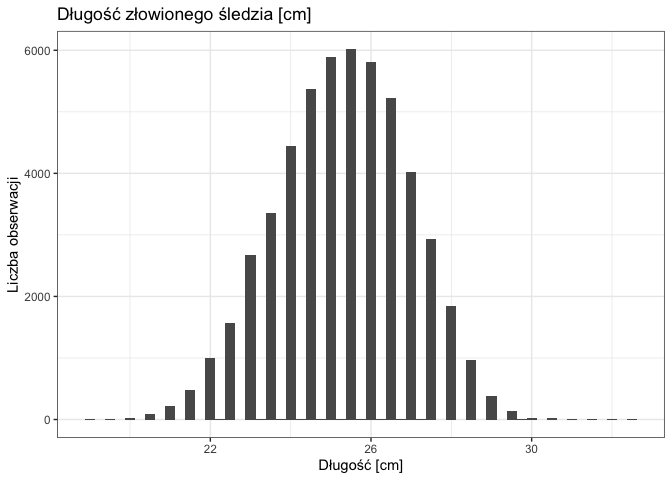
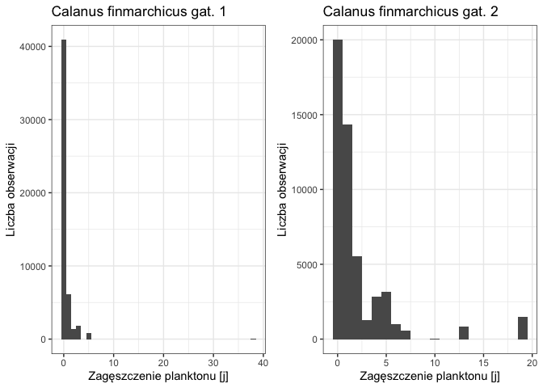
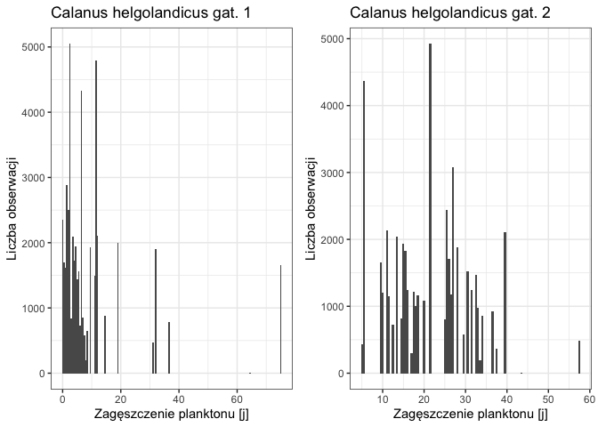
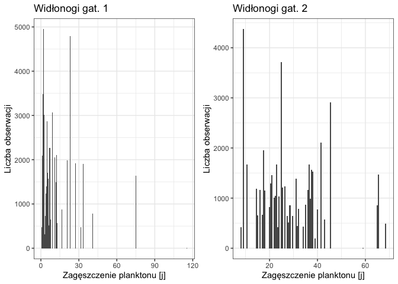
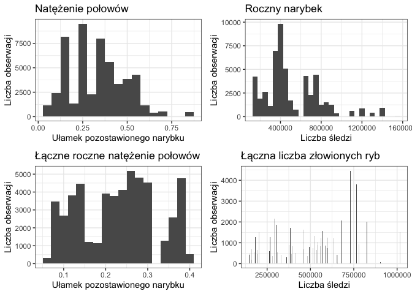
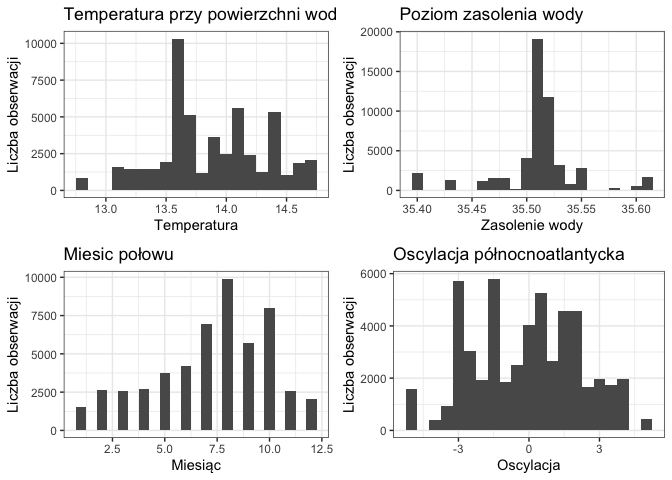
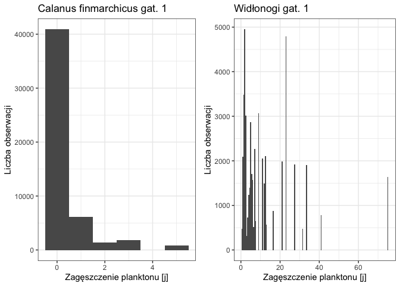

Podsumowanie analizy
====================

TODO: Podsumowanie na koniec

Wykorzystane biblioteki
=======================

-   `knitr`
-   `dplyr`
-   `tidyverse`
-   `ggplot2`
-   `gridExtra`

Ustawienie ziarna generatora
============================

Celem zapewnienia powtarzalności operacji losowania, a co za tym idzie
powtarzalności wyników przy każdym uruchomieniu raportu na tych samych
danych zastosowano ziarno generatora o wartości `102019`.

``` r
set.seed(102019)
```

Charakterystyka obserwacji - zastosowane atrybuty
=================================================

W ramach analizy mamy do czynienia z obserwacjami opisanymi za pomocą
następujących atrybutów:

-   **length**: długość złowionego śledzia \[cm\]
-   **cfin1**: dostępność planktonu \[zagęszczenie *Calanus
    finmarchicus* gat. 1\]
-   **cfin2**: dostępność planktonu \[zagęszczenie *Calanus
    finmarchicus* gat. 2\];
-   **chel1**: dostępność planktonu \[zagęszczenie *Calanus
    helgolandicus* gat. 1\];
-   **chel2**: dostępność planktonu \[zagęszczenie *Calanus
    helgolandicus* gat. 2\];
-   **lcop1**: dostępność planktonu \[zagęszczenie *widłonogów* gat.
    1\];
-   **lcop2**: dostępność planktonu \[zagęszczenie *widłonogów* gat.
    2\];
-   **fbar**: natężenie połowów w regionie \[ułamek pozostawionego
    narybku\];
-   **recr**: roczny narybek \[liczba śledzi\];
-   **cumf**: łączne roczne natężenie połowów w regionie \[ułamek
    pozostawionego narybku\];
-   **totaln**: łączna liczba ryb złowionych w ramach połowu \[liczba
    śledzi\];
-   **sst**: temperatura przy powierzchni wody \[°C\];
-   **sal**: poziom zasolenia wody \[Knudsen ppt\];
-   **xmonth**: miesiąc połowu \[numer miesiąca\];
-   **nao**: oscylacja północnoatlantycka \[mb\].

Wczytanie danych z pliku
========================

Dane zamieszczone na stronie przedmiotu w postaci pliku CSV pobieramy
wyłącznie w sytuacji braku pliku w katalogu roboczym. Pozwala to nam na
ograniczenie niepotrzebnego transferu danych, jeżeli plik już istnieje.

``` r
file_name = "sledzie.csv"
source_url = "http://www.cs.put.poznan.pl/alabijak/emd/projekt/sledzie.csv"

if (!file.exists(file_name)) {
  download.file(source_url, destfile = file_name, method = "wget")
}
```

Po ewentualnym pobraniu wczytujemy dane do pamięci.

``` r
library('knitr')
library('dplyr')
library('tidyverse')

content =
  file_name %>%
  read_csv(col_names = TRUE, na = c("", "NA", "?")) %>%
  select(-1)

content[0:11] %>%
  head(n = 5) %>%
  kable(align = 'c', caption = 'Wybrane pomiary')
```

| length |  cfin1  |  cfin2  |  chel1  |   chel2  |  lcop1  |   lcop2  |  fbar |  recr  |    cumf   |  totaln  |
|:------:|:-------:|:-------:|:-------:|:--------:|:-------:|:--------:|:-----:|:------:|:---------:|:--------:|
|  23.0  | 0.02778 | 0.27785 | 2.46875 |    NA    | 2.54787 | 26.35881 | 0.356 | 482831 | 0.3059879 | 267380.8 |
|  22.5  | 0.02778 | 0.27785 | 2.46875 | 21.43548 | 2.54787 | 26.35881 | 0.356 | 482831 | 0.3059879 | 267380.8 |
|  25.0  | 0.02778 | 0.27785 | 2.46875 | 21.43548 | 2.54787 | 26.35881 | 0.356 | 482831 | 0.3059879 | 267380.8 |
|  25.5  | 0.02778 | 0.27785 | 2.46875 | 21.43548 | 2.54787 | 26.35881 | 0.356 | 482831 | 0.3059879 | 267380.8 |
|  24.0  | 0.02778 | 0.27785 | 2.46875 | 21.43548 | 2.54787 | 26.35881 | 0.356 | 482831 | 0.3059879 | 267380.8 |

Oryginalnie zbiór posiada znaki `?` jako oznaczenie wartości pustej
(brakującej). Dzięki wykorzystaniu parametru `na` podczas wywołania
funkcji `read_csv` możemy zastąpić znak `?` poprawnym oznaczeniem braku
wartości `NA`. W tabeli `Wybrane pomiary` zaprezentowano pierwsze pięć
obserwacji.

Podstawowe statystyki zbioru danych
===================================

``` r
total_records = count(content)
total_records_without_na_values = count(na.omit(content))
```

W zbiorze danych mamy do czynienia z 52582 obserwacjami opisanych za
pomocą 15 atrybutów. W całym zbiorze mamy do czynienia z 42488
obserwacjami bez wartości pustych co stanowi 81 procent całego zbioru.

Statystyka parametrów obserwacji
--------------------------------

``` r
content %>%
  summary() %>%
  kable(align = 'c', caption = 'Statystyka zbioru danych')
```

|       |      length     |        cfin1        |      cfin2      |      chel1     |      chel2     |       lcop1      |      lcop2     |      fbar      |       recr      |       cumf      |      totaln     |      sst      |      sal      |     xmonth     |        nao       |
|-------|:---------------:|:-------------------:|:---------------:|:--------------:|:--------------:|:----------------:|:--------------:|:--------------:|:---------------:|:---------------:|:---------------:|:-------------:|:-------------:|:--------------:|:----------------:|
|       |    Min. :19.0   |    Min. : 0.0000    |  Min. : 0.0000  |  Min. : 0.000  |  Min. : 5.238  |   Min. : 0.3074  |  Min. : 7.849  |  Min. :0.0680  |  Min. : 140515  |  Min. :0.06833  |  Min. : 144137  |  Min. :12.77  |  Min. :35.40  |  Min. : 1.000  |  Min. :-4.89000  |
|       |   1st Qu.:24.0  |   1st Qu.: 0.0000   | 1st Qu.: 0.2778 | 1st Qu.: 2.469 | 1st Qu.:13.427 |  1st Qu.: 2.5479 | 1st Qu.:17.808 | 1st Qu.:0.2270 | 1st Qu.: 360061 | 1st Qu.:0.14809 | 1st Qu.: 306068 | 1st Qu.:13.60 | 1st Qu.:35.51 | 1st Qu.: 5.000 | 1st Qu.:-1.89000 |
|       |   Median :25.5  |   Median : 0.1111   | Median : 0.7012 | Median : 5.750 | Median :21.673 |  Median : 7.0000 | Median :24.859 | Median :0.3320 | Median : 421391 | Median :0.23191 | Median : 539558 | Median :13.86 | Median :35.51 | Median : 8.000 | Median : 0.20000 |
|       |    Mean :25.3   |    Mean : 0.4458    |  Mean : 2.0248  |  Mean :10.006  |  Mean :21.221  |  Mean : 12.8108  |  Mean :28.419  |  Mean :0.3304  |  Mean : 520366  |  Mean :0.22981  |  Mean : 514973  |  Mean :13.87  |  Mean :35.51  |  Mean : 7.258  |  Mean :-0.09236  |
|       |   3rd Qu.:26.5  |   3rd Qu.: 0.3333   | 3rd Qu.: 1.7936 | 3rd Qu.:11.500 | 3rd Qu.:27.193 | 3rd Qu.: 21.2315 | 3rd Qu.:37.232 | 3rd Qu.:0.4560 | 3rd Qu.: 724151 | 3rd Qu.:0.29803 | 3rd Qu.: 730351 | 3rd Qu.:14.16 | 3rd Qu.:35.52 | 3rd Qu.: 9.000 | 3rd Qu.: 1.63000 |
|       |    Max. :32.5   |    Max. :37.6667    |  Max. :19.3958  |  Max. :75.000  |  Max. :57.706  |  Max. :115.5833  |  Max. :68.736  |  Max. :0.8490  |  Max. :1565890  |  Max. :0.39801  |  Max. :1015595  |  Max. :14.73  |  Max. :35.61  |  Max. :12.000  |  Max. : 5.08000  |
|       |        NA       |      NA’s :1581     |    NA’s :1536   |   NA’s :1555   |   NA’s :1556   |    NA’s :1653    |   NA’s :1591   |       NA       |        NA       |        NA       |        NA       |   NA’s :1584  |       NA      |       NA       |        NA        |
| TODO: | Poprawić tabelk | ę, nie mieści się n |  a stronie PDF  |                |                |                  |                |                |                 |                 |                 |               |               |                |                  |

Rozkład wartości cech
---------------------

``` r
library('ggplot2')
library('gridExtra')

ggplot(content, aes(x = length)) + geom_histogram(binwidth = 0.25) + 
  theme_bw() + ggtitle('Długość złowionego śledzia [cm]') + 
  xlab(sprintf('Długość [cm]')) + ylab('Liczba obserwacji')
```


Jak możemy zaobserwować, większość śledzi w połowie ma długość od 23 do
27 centymetrów.

``` r
plot_cfin1 <- ggplot(content, aes(x = cfin1)) + geom_histogram(binwidth = 1.0) +
  theme_bw() + ggtitle('Calanus finmarchicus gat. 1') + 
  xlab(sprintf('Zagęszczenie planktonu [j]')) + ylab('Liczba obserwacji')

plot_cfin2 <- ggplot(content, aes(x = cfin2)) + geom_histogram(binwidth = 1.0) +
  theme_bw() + ggtitle('Calanus finmarchicus gat. 2') + 
  xlab(sprintf('Zagęszczenie planktonu [j]')) + ylab('Liczba obserwacji')

grid.arrange(plot_cfin1, plot_cfin2, nrow = 1)
```



``` r
plot_chel1 <- ggplot(content, aes(x = chel1)) + geom_histogram(binwidth = 0.5) +
  theme_bw() + ggtitle('Calanus helgolandicus gat. 1') + 
  xlab(sprintf('Zagęszczenie planktonu [j]')) + ylab('Liczba obserwacji')

plot_chel2 <- ggplot(content, aes(x = chel2)) + geom_histogram(binwidth = 0.5) +
  theme_bw() + ggtitle('Calanus helgolandicus gat. 2') + 
  xlab(sprintf('Zagęszczenie planktonu [j]')) + ylab('Liczba obserwacji')

grid.arrange(plot_chel1, plot_chel2, nrow = 1)
```



``` r
plot_lcop1 <- ggplot(content, aes(x = lcop1)) + geom_histogram(binwidth = 0.5) +
  theme_bw() + ggtitle('Widłonogi gat. 1') + 
  xlab(sprintf('Zagęszczenie planktonu [j]')) + ylab('Liczba obserwacji')

plot_lcop2 <- ggplot(content, aes(x = lcop2)) + geom_histogram(binwidth = 0.5) +
  theme_bw() + ggtitle('Widłonogi gat. 2') + 
  xlab(sprintf('Zagęszczenie planktonu [j]')) + ylab('Liczba obserwacji')

grid.arrange(plot_lcop1, plot_lcop2, nrow = 1)
```



``` r
plot_fbar <- ggplot(content, aes(x = fbar)) + geom_histogram(binwidth = 0.05) +
  theme_bw() + ggtitle('Natężenie połowów') + 
  xlab(sprintf('Ułamek pozostawionego narybku')) + ylab('Liczba obserwacji')

plot_recr <- ggplot(content, aes(x = recr)) + geom_histogram(binwidth = 50000.0) +
  theme_bw() + ggtitle('Roczny narybek') + 
  xlab(sprintf('Liczba śledzi')) + ylab('Liczba obserwacji')

plot_cumf <- ggplot(content, aes(x = cumf)) + geom_histogram(binwidth = 0.02) +
  theme_bw() + ggtitle('Łączne roczne natężenie połowów') + 
  xlab(sprintf('Ułamek pozostawionego narybku')) + ylab('Liczba obserwacji')

plot_totaln <- ggplot(content, aes(x = totaln)) + geom_histogram(binwidth = 1000.0) +
  theme_bw() + ggtitle('Łączna liczba złowionych ryb') + 
  xlab(sprintf('Liczba śledzi')) + ylab('Liczba obserwacji')

grid.arrange(plot_fbar, plot_recr, plot_cumf, plot_totaln, nrow = 2)
```



``` r
plot_sst <- ggplot(content, aes(x = sst)) + geom_histogram(binwidth = 0.1) +
  theme_bw() + ggtitle('Temperatura przy powierzchni wody') + 
  xlab(sprintf('Temperatura')) + ylab('Liczba obserwacji')

plot_sal <- ggplot(content, aes(x = sal)) + geom_histogram(binwidth = 0.01) +
  theme_bw() + ggtitle('Poziom zasolenia wody') + 
  xlab(sprintf('Zasolenie wody')) + ylab('Liczba obserwacji')

plot_xmonth <- ggplot(content, aes(x = xmonth)) + geom_histogram(binwidth = 0.5) +
  theme_bw() + ggtitle('Miesic połowu') + 
  xlab(sprintf('Miesiąc')) + ylab('Liczba obserwacji')

plot_nao <- ggplot(content, aes(x = nao)) + geom_histogram(binwidth = 0.5) +
  theme_bw() + ggtitle('Oscylacja północnoatlantycka') + 
  xlab(sprintf('Oscylacja')) + ylab('Liczba obserwacji')

grid.arrange(plot_sst, plot_sal, plot_xmonth, plot_nao, nrow = 2)
```



Analizując przedstawione wykresy dotyczące poszczególnych atrybutów
opisujących połowy możemy zaobserwować rozkład zbliżony do normalnego
dla wielu z nich (chociażby parametr długości śledzia). W przypadku
parametrów dostępności planktonu *Calanus finmarchicus gat. 1* oraz
*Widłonogów gat. 1* obserwujemy występowanie drobnej próbki danych
odbierających znacząco od reszty. Na potrzeby dalszego przetwarzania
dane zostaną oczyszczone z tych obserwacji odstających.

``` r
without_outliers =
  content %>%
  filter(cfin1 <= 10 | is.na(cfin1)) %>%
  filter(lcop1 <= 90 | is.na(lcop1))
```

Po operacji w zbiorze obserwacji pozostało 52576 próbek (usunięto 6
obserwacji).

``` r
plot_cfin1_clear <- ggplot(without_outliers, aes(x = cfin1)) + geom_histogram(binwidth = 1.0) +
  theme_bw() + ggtitle('Calanus finmarchicus gat. 1') + 
  xlab(sprintf('Zagęszczenie planktonu [j]')) + ylab('Liczba obserwacji')

plot_lcop1_clear <- ggplot(without_outliers, aes(x = lcop1)) + geom_histogram(binwidth = 0.5) +
  theme_bw() + ggtitle('Widłonogi gat. 1') + 
  xlab(sprintf('Zagęszczenie planktonu [j]')) + ylab('Liczba obserwacji')

grid.arrange(plot_cfin1_clear, plot_lcop1_clear, nrow = 1)
```



Przetwarzanie brakujących danych
================================

TODO: Analiza jakie atrybuty oraz liczność TODO: Uśrednienie wartości
bazując na rozkładzie
