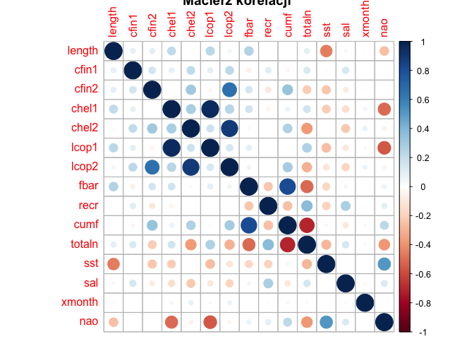

Podsumowanie analizy
====================

TODO: Podsumowanie na koniec

Wykorzystane biblioteki
=======================

-   `knitr`
-   `dplyr`
-   `tidyverse`
-   `ggplot2`
-   `gridExtra`
-   `imputeTS`
-   `corrplot`
-   `reshape2`

Ustawienie ziarna generatora
============================

Celem zapewnienia powtarzalności operacji losowania, a co za tym idzie
powtarzalności wyników przy każdym uruchomieniu raportu na tych samych
danych zastosowano ziarno generatora o wartości `102019`.

``` r
set.seed(102019)
```

Charakterystyka obserwacji - zastosowane atrybuty
=================================================

W ramach analizy mamy do czynienia z obserwacjami opisanymi za pomocą
następujących atrybutów:

-   **length**: długość złowionego śledzia \[cm\]
-   **cfin1**: dostępność planktonu \[zagęszczenie *Calanus
    finmarchicus* gat. 1\]
-   **cfin2**: dostępność planktonu \[zagęszczenie *Calanus
    finmarchicus* gat. 2\];
-   **chel1**: dostępność planktonu \[zagęszczenie *Calanus
    helgolandicus* gat. 1\];
-   **chel2**: dostępność planktonu \[zagęszczenie *Calanus
    helgolandicus* gat. 2\];
-   **lcop1**: dostępność planktonu \[zagęszczenie *widłonogów* gat.
    1\];
-   **lcop2**: dostępność planktonu \[zagęszczenie *widłonogów* gat.
    2\];
-   **fbar**: natężenie połowów w regionie \[ułamek pozostawionego
    narybku\];
-   **recr**: roczny narybek \[liczba śledzi\];
-   **cumf**: łączne roczne natężenie połowów w regionie \[ułamek
    pozostawionego narybku\];
-   **totaln**: łączna liczba ryb złowionych w ramach połowu \[liczba
    śledzi\];
-   **sst**: temperatura przy powierzchni wody \[°C\];
-   **sal**: poziom zasolenia wody \[Knudsen ppt\];
-   **xmonth**: miesiąc połowu \[numer miesiąca\];
-   **nao**: oscylacja północnoatlantycka \[mb\].

Wczytanie danych z pliku
========================

Dane zamieszczone na stronie przedmiotu w postaci pliku CSV pobieramy
wyłącznie w sytuacji braku pliku w katalogu roboczym. Pozwala to nam na
ograniczenie niepotrzebnego transferu danych, jeżeli plik już istnieje.

``` r
file_name = "sledzie.csv"
source_url = "http://www.cs.put.poznan.pl/alabijak/emd/projekt/sledzie.csv"

if (!file.exists(file_name)) {
  download.file(source_url, destfile = file_name, method = "wget")
}
```

Po ewentualnym pobraniu wczytujemy dane do pamięci.

``` r
library('knitr')
library('dplyr')
library('tidyverse')

content =
  file_name %>%
  read_csv(col_names = TRUE, na = c("", "NA", "?")) %>%
  select(-1)

content[0:11] %>%
  head(n = 5) %>%
  kable(align = 'c', caption = 'Wybrane pomiary')
```

| length |  cfin1  |  cfin2  |  chel1  |   chel2  |  lcop1  |   lcop2  |  fbar |  recr  |    cumf   |  totaln  |
|:------:|:-------:|:-------:|:-------:|:--------:|:-------:|:--------:|:-----:|:------:|:---------:|:--------:|
|  23.0  | 0.02778 | 0.27785 | 2.46875 |    NA    | 2.54787 | 26.35881 | 0.356 | 482831 | 0.3059879 | 267380.8 |
|  22.5  | 0.02778 | 0.27785 | 2.46875 | 21.43548 | 2.54787 | 26.35881 | 0.356 | 482831 | 0.3059879 | 267380.8 |
|  25.0  | 0.02778 | 0.27785 | 2.46875 | 21.43548 | 2.54787 | 26.35881 | 0.356 | 482831 | 0.3059879 | 267380.8 |
|  25.5  | 0.02778 | 0.27785 | 2.46875 | 21.43548 | 2.54787 | 26.35881 | 0.356 | 482831 | 0.3059879 | 267380.8 |
|  24.0  | 0.02778 | 0.27785 | 2.46875 | 21.43548 | 2.54787 | 26.35881 | 0.356 | 482831 | 0.3059879 | 267380.8 |

Oryginalnie zbiór posiada znaki `?` jako oznaczenie wartości pustej
(brakującej). Dzięki wykorzystaniu parametru `na` podczas wywołania
funkcji `read_csv` możemy zastąpić znak `?` poprawnym oznaczeniem braku
wartości `NA`. W tabeli `Wybrane pomiary` zaprezentowano pierwsze pięć
obserwacji.

Podstawowe statystyki zbioru danych
===================================

``` r
total_records = count(content)
total_records_without_na_values = count(na.omit(content))
```

W zbiorze danych mamy do czynienia z 52582 obserwacjami opisanych za
pomocą 15 atrybutów. W całym zbiorze mamy do czynienia z 42488
obserwacjami bez wartości pustych co stanowi 81 procent całego zbioru.

Statystyka parametrów obserwacji
--------------------------------

``` r
content %>%
  summary() %>%
  kable(align = 'c', caption = 'Statystyka zbioru danych')
```

|     |    length    |      cfin1      |      cfin2      |      chel1     |      chel2     |       lcop1      |      lcop2     |      fbar      |       recr      |       cumf      |      totaln     |      sst      |      sal      |     xmonth     |        nao       |
|-----|:------------:|:---------------:|:---------------:|:--------------:|:--------------:|:----------------:|:--------------:|:--------------:|:---------------:|:---------------:|:---------------:|:-------------:|:-------------:|:--------------:|:----------------:|
|     |  Min. :19.0  |  Min. : 0.0000  |  Min. : 0.0000  |  Min. : 0.000  |  Min. : 5.238  |   Min. : 0.3074  |  Min. : 7.849  |  Min. :0.0680  |  Min. : 140515  |  Min. :0.06833  |  Min. : 144137  |  Min. :12.77  |  Min. :35.40  |  Min. : 1.000  |  Min. :-4.89000  |
|     | 1st Qu.:24.0 | 1st Qu.: 0.0000 | 1st Qu.: 0.2778 | 1st Qu.: 2.469 | 1st Qu.:13.427 |  1st Qu.: 2.5479 | 1st Qu.:17.808 | 1st Qu.:0.2270 | 1st Qu.: 360061 | 1st Qu.:0.14809 | 1st Qu.: 306068 | 1st Qu.:13.60 | 1st Qu.:35.51 | 1st Qu.: 5.000 | 1st Qu.:-1.89000 |
|     | Median :25.5 | Median : 0.1111 | Median : 0.7012 | Median : 5.750 | Median :21.673 |  Median : 7.0000 | Median :24.859 | Median :0.3320 | Median : 421391 | Median :0.23191 | Median : 539558 | Median :13.86 | Median :35.51 | Median : 8.000 | Median : 0.20000 |
|     |  Mean :25.3  |  Mean : 0.4458  |  Mean : 2.0248  |  Mean :10.006  |  Mean :21.221  |  Mean : 12.8108  |  Mean :28.419  |  Mean :0.3304  |  Mean : 520366  |  Mean :0.22981  |  Mean : 514973  |  Mean :13.87  |  Mean :35.51  |  Mean : 7.258  |  Mean :-0.09236  |
|     | 3rd Qu.:26.5 | 3rd Qu.: 0.3333 | 3rd Qu.: 1.7936 | 3rd Qu.:11.500 | 3rd Qu.:27.193 | 3rd Qu.: 21.2315 | 3rd Qu.:37.232 | 3rd Qu.:0.4560 | 3rd Qu.: 724151 | 3rd Qu.:0.29803 | 3rd Qu.: 730351 | 3rd Qu.:14.16 | 3rd Qu.:35.52 | 3rd Qu.: 9.000 | 3rd Qu.: 1.63000 |
|     |  Max. :32.5  |  Max. :37.6667  |  Max. :19.3958  |  Max. :75.000  |  Max. :57.706  |  Max. :115.5833  |  Max. :68.736  |  Max. :0.8490  |  Max. :1565890  |  Max. :0.39801  |  Max. :1015595  |  Max. :14.73  |  Max. :35.61  |  Max. :12.000  |  Max. : 5.08000  |
|     |      NA      |    NA’s :1581   |    NA’s :1536   |   NA’s :1555   |   NA’s :1556   |    NA’s :1653    |   NA’s :1591   |       NA       |        NA       |        NA       |        NA       |   NA’s :1584  |       NA      |       NA       |        NA        |

TODO: Poprawić tabelkę, nie mieści się na stronie PDF

Rozkład wartości cech
---------------------

``` r
library('ggplot2')
library('gridExtra')

ggplot(content, aes(x = length)) + geom_histogram(binwidth = 0.25) + 
  theme_bw() + ggtitle('Długość złowionego śledzia [cm]') + 
  xlab(sprintf('Długość [cm]')) + ylab('Liczba obserwacji')
```


Jak możemy zaobserwować, większość śledzi w połowie ma długość od 23 do
27 centymetrów.

``` r
plot_cfin1 <- ggplot(content, aes(x = cfin1)) + geom_histogram(binwidth = 1.0) +
  theme_bw() + ggtitle('Calanus finmarchicus gat. 1') + 
  xlab(sprintf('Zagęszczenie planktonu [j]')) + ylab('Liczba obserwacji')

plot_cfin2 <- ggplot(content, aes(x = cfin2)) + geom_histogram(binwidth = 1.0) +
  theme_bw() + ggtitle('Calanus finmarchicus gat. 2') + 
  xlab(sprintf('Zagęszczenie planktonu [j]')) + ylab('Liczba obserwacji')

grid.arrange(plot_cfin1, plot_cfin2, nrow = 1)
```


``` r
plot_chel1 <- ggplot(content, aes(x = chel1)) + geom_histogram(binwidth = 0.5) +
  theme_bw() + ggtitle('Calanus helgolandicus gat. 1') + 
  xlab(sprintf('Zagęszczenie planktonu [j]')) + ylab('Liczba obserwacji')

plot_chel2 <- ggplot(content, aes(x = chel2)) + geom_histogram(binwidth = 0.5) +
  theme_bw() + ggtitle('Calanus helgolandicus gat. 2') + 
  xlab(sprintf('Zagęszczenie planktonu [j]')) + ylab('Liczba obserwacji')

grid.arrange(plot_chel1, plot_chel2, nrow = 1)
```


``` r
plot_lcop1 <- ggplot(content, aes(x = lcop1)) + geom_histogram(binwidth = 0.5) +
  theme_bw() + ggtitle('Widłonogi gat. 1') + 
  xlab(sprintf('Zagęszczenie planktonu [j]')) + ylab('Liczba obserwacji')

plot_lcop2 <- ggplot(content, aes(x = lcop2)) + geom_histogram(binwidth = 0.5) +
  theme_bw() + ggtitle('Widłonogi gat. 2') + 
  xlab(sprintf('Zagęszczenie planktonu [j]')) + ylab('Liczba obserwacji')

grid.arrange(plot_lcop1, plot_lcop2, nrow = 1)
```


``` r
plot_fbar <- ggplot(content, aes(x = fbar)) + geom_histogram(binwidth = 0.05) +
  theme_bw() + ggtitle('Natężenie połowów') + 
  xlab(sprintf('Ułamek pozostawionego narybku')) + ylab('Liczba obserwacji')

plot_recr <- ggplot(content, aes(x = recr)) + geom_histogram(binwidth = 50000.0) +
  theme_bw() + ggtitle('Roczny narybek') + 
  xlab(sprintf('Liczba śledzi')) + ylab('Liczba obserwacji')

plot_cumf <- ggplot(content, aes(x = cumf)) + geom_histogram(binwidth = 0.02) +
  theme_bw() + ggtitle('Łączne roczne natężenie połowów') + 
  xlab(sprintf('Ułamek pozostawionego narybku')) + ylab('Liczba obserwacji')

plot_totaln <- ggplot(content, aes(x = totaln)) + geom_histogram(binwidth = 1000.0) +
  theme_bw() + ggtitle('Łączna liczba złowionych ryb') + 
  xlab(sprintf('Liczba śledzi')) + ylab('Liczba obserwacji')

grid.arrange(plot_fbar, plot_recr, plot_cumf, plot_totaln, nrow = 2)
```


``` r
plot_sst <- ggplot(content, aes(x = sst)) + geom_histogram(binwidth = 0.1) +
  theme_bw() + ggtitle('Temperatura przy powierzchni wody') + 
  xlab(sprintf('Temperatura')) + ylab('Liczba obserwacji')

plot_sal <- ggplot(content, aes(x = sal)) + geom_histogram(binwidth = 0.01) +
  theme_bw() + ggtitle('Poziom zasolenia wody') + 
  xlab(sprintf('Zasolenie wody')) + ylab('Liczba obserwacji')

plot_xmonth <- ggplot(content, aes(x = xmonth)) + geom_histogram(binwidth = 0.5) +
  theme_bw() + ggtitle('Miesic połowu') + 
  xlab(sprintf('Miesiąc')) + ylab('Liczba obserwacji')

plot_nao <- ggplot(content, aes(x = nao)) + geom_histogram(binwidth = 0.5) +
  theme_bw() + ggtitle('Oscylacja północnoatlantycka') + 
  xlab(sprintf('Oscylacja')) + ylab('Liczba obserwacji')

grid.arrange(plot_sst, plot_sal, plot_xmonth, plot_nao, nrow = 2)
```


Analizując przedstawione wykresy dotyczące poszczególnych atrybutów
opisujących połowy możemy zaobserwować rozkład zbliżony do normalnego
dla wielu z nich (chociażby parametr długości śledzia). W przypadku
parametrów dostępności planktonu *Calanus finmarchicus gat. 1* oraz
*Widłonogów gat. 1* obserwujemy występowanie drobnej próbki danych
odbierających znacząco od reszty. Na potrzeby dalszego przetwarzania
dane zostaną oczyszczone z tych obserwacji odstających.

TODO: Można opisać pozostałe wykresy bazując na danych w tabeli
poprzedniej (min, max …)

``` r
without_outliers =
  content %>%
  filter(cfin1 <= 10 | is.na(cfin1)) %>%
  filter(lcop1 <= 90 | is.na(lcop1))
```

Po operacji w zbiorze obserwacji pozostało 52576 próbek (usunięto 6
obserwacji).

``` r
plot_cfin1_clear <- ggplot(without_outliers, aes(x = cfin1)) + geom_histogram(binwidth = 1.0) +
  theme_bw() + ggtitle('Calanus finmarchicus gat. 1') + 
  xlab(sprintf('Zagęszczenie planktonu [j]')) + ylab('Liczba obserwacji')

plot_lcop1_clear <- ggplot(without_outliers, aes(x = lcop1)) + geom_histogram(binwidth = 0.5) +
  theme_bw() + ggtitle('Widłonogi gat. 1') + 
  xlab(sprintf('Zagęszczenie planktonu [j]')) + ylab('Liczba obserwacji')

grid.arrange(plot_cfin1_clear, plot_lcop1_clear, nrow = 1)
```


Przetwarzanie brakujących danych
================================

Korzystajac z pakietu `imputeTS` i funkcji `statsNA` możemy
przeprowadzić analizę wartości pustych w poszczególnych obserwacjach.

``` r
library('imputeTS')

without_outliers %>%
  colnames() %>%
  sapply(function(attr) {
    statsNA(without_outliers[[attr]], printOnly = FALSE)
  }) %>%
  kable()
```

|                     | length | cfin1 | cfin2 | chel1 | chel2 | lcop1 | lcop2 | fbar  | recr  | cumf  | totaln | sst   | sal   | xmonth | nao   |
|---------------------|:-------|:------|:------|:------|:------|:------|:------|:------|:------|:------|:-------|:------|:------|:-------|:------|
| lengthTimeSeries    | 52576  | 52576 | 52576 | 52576 | 52576 | 52576 | 52576 | 52576 | 52576 | 52576 | 52576  | 52576 | 52576 | 52576  | 52576 |
| numberNAs           | 0      | 1581  | 1536  | 1555  | 1556  | 1653  | 1591  | 0     | 0     | 0     | 0      | 1584  | 0     | 0      | 0     |
| percentageNAs       | 0%     | 3.01% | 2.92% | 2.96% | 2.96% | 3.14% | 3.03% | 0%    | 0%    | 0%    | 0%     | 3.01% | 0%    | 0%     | 0%    |
| naGapLongest        | NA     | 3     | 3     | 3     | 3     | 2     | 3     | NA    | NA    | NA    | NA     | 3     | NA    | NA     | NA    |
| naGapMostFrequent   | 52576  | 1     | 1     | 1     | 1     | 1     | 1     | 52576 | 52576 | 52576 | 52576  | 1     | 52576 | 52576  | 52576 |
| naGapMostOverallNAs | 52576  | 1     | 1     | 1     | 1     | 1     | 1     | 52576 | 52576 | 52576 | 52576  | 1     | 52576 | 52576  | 52576 |

TODO: Poprawić tabelkę, źle wygląda w PDF

Analizując zaprezentowane podsumowania dla wszystkich atrybutów, możemy
zauważyć że wartości puste stanowią mniej niż 3.5% całego zbioru
obserwacji. Ponadto ich rozkład ma charater losowy oraz są równomierne.
W danych nie występują długie serie wartości pustych (sekwencje liczące
dwie oraz trzy wartości puste są rzadkie). Wykorzystując wiedzę o
charakterystyce danych możemy wykonać interpolację z wykorzystaniem
filtru Kalmana, aby pozbyć się wartości pustych.

``` r
without_outliers$cfin1 <- na_kalman(without_outliers$cfin1)
without_outliers$cfin2 <- na_kalman(without_outliers$cfin2)
without_outliers$chel1 <- na_kalman(without_outliers$chel1)
without_outliers$chel2 <- na_kalman(without_outliers$chel2)
without_outliers$lcop1 <- na_kalman(without_outliers$lcop1)
without_outliers$lcop2 <- na_kalman(without_outliers$lcop2)
without_outliers$sst <- na_kalman(without_outliers$sst)
```

TODO: Użyć jakieś funkcji

Korelacja atrybutów
===================

``` r
library('corrplot')

corelation_matrix <- cor(without_outliers)
corrplot(corelation_matrix, method = "circle", title = "Macierz korelacji")
```



Na wykresie powyższym została przedstawiona macierz korelacji pomiędzy
poszczególnymi atrybutami. Jak możemy zaobserwować, istnieje bardzo
silna pozytywna korelacja pomiędzy parametrem `chel1` oraz `lcop1`
(wynosząca w przybliżeniu `0.96`), a także `chel2` oraz `lcop2`
(wynosząca `0.88`). Wynika z tego że występowanie planktonu
`Calanus helgolandicus gat. 1` związane jest z obecnością
`widłonogów gat. 1` i vice versa. Podobnie w przypadku planktonów
drugiego gatunku czyli pary `Calanus helgolandicus gat. 2` oraz
`widłonogi gat. 2`.

Analizując dalej macierz korelacji możemy zaobserwować pozytywną
zależność pomiędzy `cfin2` i `lcop2` wynosząca `0.65` - zagęszczenie
`Calanus finmarchicus gat. 2` ma powiązanie w obecności
`widłonogów gat. 2`.

Ciekawą zależnością jest `sst` oraz `nao`. Korzystając z opisu
`oscylacji północnoatlantyckiej` na stronie encyklopedii
[Wikipedia](https://pl.wikipedia.org/wiki/Oscylacja_p%C3%B3%C5%82nocnoatlantycka)
mamy do czynienia ze zjawiskiem meterologicznym wpływającym na klimat,
co manifestuje się między innymi zmianą temperatury. Podkreśla to
wiarygodność naszych obserwacji, gdyż doszło do odwzorowania zjawiska
fizycznego w naszych danych.

Wysoką wartość zależności `fbar` oznaczającej
`natężenia połowów w regionie` oraz `cumf` czyli
`łączne roczne natężenie połowów w regionie` wynoszącej `0.82` można
łatwo wyjaśnić. Łowienie w danym miejscu przez długi czas sumarycznie
wpłynie na wysoką wartość drugiego parametru.

Interesującą z punktu widzenia tematu raportu jest zależność temperatury
przy powierzchni wody i długości złowionego śledzia. Wynosi ona `-0.45`.
Większa temperatura ma odzwierciedlenie w mniejszych rozmiarach śledzi.

TODO: Dodać wykresy dla porównań TODO: Poprawić ten opis aby dać tekst a
nie same nazwy kolumn

Zmienność cech w ramach następujących po siebie połowów
=======================================================

W kolejnych podrozdziałach zostanie przeanalizowana zmienność cech.
Naszym celem jest wykrycie przyczyny spadku długości śledzi w połowach.

Długość śledzi
--------------

``` r
df_with_ids <- mutate(without_outliers, id = as.numeric(rownames(without_outliers)))
sampled_data <- sample_n(df_with_ids, 500)
```

``` r
zmiana_sledzi_plot <- ggplot(
  sampled_data,
  aes(x=id, y=length)
) + theme_bw() + 
  theme(axis.text.x=element_blank()) + geom_point() + geom_smooth(se = FALSE, colour = "#f5ad00", size = 1.0) + ggtitle('Zmiana długości śledzia') +  xlab('') + ylab('Długość [cm]') + geom_vline(xintercept = 17000, colour="blue", linetype = 2, size = 1.0)

zmiana_sledzi_plot
```


TODO: Opisać wykres

``` r
library('gganimate')
library('gifski')

ggplot(
  sampled_data,
  group = xmonth,
  aes(x=id, y=length)
) + theme_bw() + 
  geom_line() + transition_reveal(id)
```


TODO: Źródło danych w postaci uśrednionych danych z połowów TODO: Opisać
wykres TODO: W PDF bez tej animacji

Dostępność pokarmu
------------------

``` r
library('reshape2')

plancton_food <- melt(sampled_data[, c(16, 2:7)], id.vars = c('id'), variable.name = "TypPlanktonu", value.name = "Values")
ggplot(
  plancton_food,
  aes(id, Values, color = TypPlanktonu)
) + theme_bw() + 
  theme(axis.text.x=element_blank()) + geom_smooth(se = FALSE) + ggtitle('Zmiana dostępności pokarmu') +  xlab('') + ylab('Dostępność pokarmu [zagęszczenie]') + geom_vline(xintercept = 17000, colour="blue", linetype = 2, size = 1.0)
```


TODO: Opisać wykres

Parametry środowiska
--------------------

``` r
parametry_srodowiska <- sampled_data[, c(12, 13, 15)]
normalized_environment <- as.data.frame(lapply(parametry_srodowiska, function(x) {
  (x - min(x)) / (max(x) - min(x))
}))
normalized_environment["id"] <- sampled_data[, 16]

environment <- melt(normalized_environment, id.vars = c('id'), variable.name = "Środowisko", value.name = "Values")
ggplot(
  environment,
  aes(id, Values, color = Środowisko)
) + theme_bw() + 
  theme(axis.text.x=element_blank()) + geom_smooth(se = FALSE) + ggtitle('Zmiana warunków środowiska') +  xlab('') + ylab('Środowisko (znormalizowana wartość)') + geom_vline(xintercept = 17000, colour="blue", linetype = 2, size = 1.0)
```


TODO: Opisać wykres

Eksploatacja łowiska
--------------------

``` r
parametry_lowiska <- sampled_data[, c(8:11)]
normalized_lowisko <- as.data.frame(lapply(parametry_lowiska, function(x) {
  (x - min(x)) / (max(x) - min(x))
}))
normalized_lowisko["id"] <- sampled_data[, 16]

lowisko <- melt(normalized_lowisko, id.vars = c('id'), variable.name = "Łowisko", value.name = "Values")
ggplot(
  lowisko,
  aes(id, Values, color = Łowisko)
) + theme_bw() + 
  theme(axis.text.x=element_blank()) + geom_smooth(se = FALSE) + ggtitle('Zmiana warunków eksploracji łowiska') +  xlab('') + ylab('Łowisko (znormalizowana wartość)') + geom_vline(xintercept = 17000, colour="blue", linetype = 2, size = 1.0)
```


TODO: Opisać wykres

Regresor - predykcja
====================

TODO: Dwa regresory TODO: Wskazanie najważniejszych cech TODO:
Obliczenie błędów
